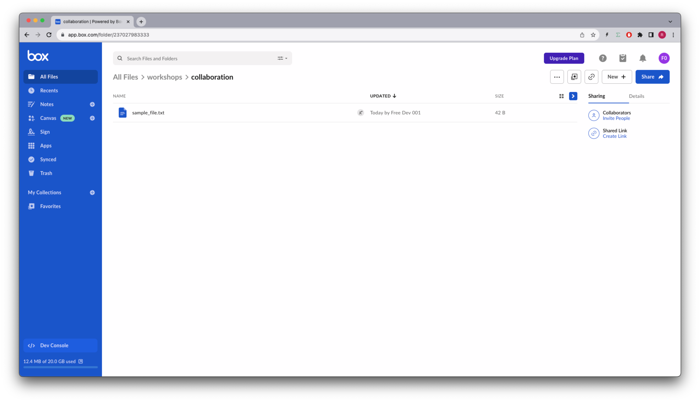
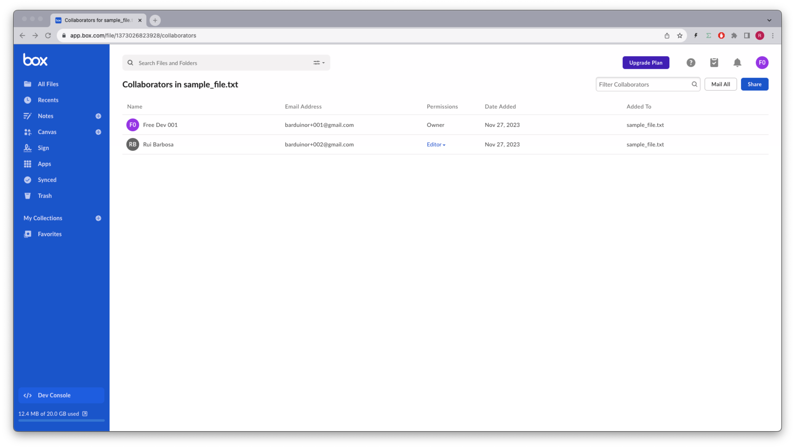

# Collaboration
Collaborations are at the core of Box. They allow users to share content with other users in a similar way as access control lists (ACLs) do in traditional file systems.

## Concepts
A collaboration is a relationship between a user and an item (file or folder) that grants the user access to the item, with a specific set of roles.

The collaboration roles are `editor`, `viewer`, `previewer`, `uploader`, `previewer uploader`, `viewer uploader`, `co-owner`, or `owner`. 

For a full description of each role, please refer to our [support documentation](https://support.box.com/hc/en-us/articles/360044196413-Understanding-Collaborator-Permission-Levels).

You can create collaborations for files and folders, targeting groups of users when groups are created in the enterprise.

Administrators can also limit external collaborations to an allowed list of domains. If this is configured, then the authorized domains must be white listed.

The SDK also provides a set of API's to manage domain whitelists.

## Collaboration API
References to our documentation:
* [SDK List collaborations](https://github.com/box/box-python-sdk-gen/blob/main/docs/list_collaborations.md)
* [SDK User collaborations](https://github.com/box/box-python-sdk-gen/blob/main/docs/user_collaborations.md)
* [API Guide](https://developer.box.com/guides/collaborations/)
* [API Reference](https://developer.box.com/reference/post-collaborations/)


# Exercises
## Setup
Create a `collaboration_init.py` file on the root of the project and execute the following code:
```python
"""create sample content to box"""
import logging
from utils.box_client_oauth import ConfigOAuth, get_client_oauth

from workshops.collaboration.create_samples import create_samples

logging.basicConfig(level=logging.INFO)
logging.getLogger("box_sdk_gen").setLevel(logging.CRITICAL)

conf = ConfigOAuth()


def main():
    client = get_client_oauth(conf)
    create_samples(client)


if __name__ == "__main__":
    main()
```
Result:
```
INFO:root:Folder workshops with id: 223095001439
INFO:root:Folder collaboration with id: 237027983333
INFO:root:      Uploaded sample_file.txt (1373026823928) 42 bytes
```

Next, create a `collaboration.py` file on the root of the project that you will use to write your code.
Create a global constant named `COLLABORATION_ROOT` and make it equal to the id of the `collaboration` folder, in my case `237027983333`
Create a global constant named `SAMPLE_FILE` and make it equal to the id of the `sample_file.txt` file, in my case `1373026823928`
We'll also need an email address to collaborate with, so create a global constant named `SAMPLE_EMAIL` and use a different email from your user associated with Box.

```python
"""Box Collaborations"""
import logging
from box_sdk_gen.fetch import APIException
from box_sdk_gen.client import BoxClient as Client
from box_sdk_gen.schemas import Collaborations, Collaboration

from box_sdk_gen.managers.user_collaborations import (
    CreateCollaborationItem,
    CreateCollaborationItemTypeField,
    CreateCollaborationAccessibleBy,
    CreateCollaborationAccessibleByTypeField,
    CreateCollaborationRole,
    UpdateCollaborationByIdRole,
)

from utils.box_client_oauth import ConfigOAuth, get_client_oauth

logging.basicConfig(level=logging.INFO)
logging.getLogger("box_sdk_gen").setLevel(logging.CRITICAL)


COLLABORATION_ROOT = "237027983333"
SAMPLE_FILE = "1373026823928"
SAMPLE_EMAIL = "YOUR_EMAIL+collab@gmail.com"

def main():
    """Simple script to demonstrate how to use the Box SDK"""
    conf = ConfigOAuth()
    client = get_client_oauth(conf)

    user = client.users.get_user_me()
    print(f"\nHello, I'm {user.name} ({user.login}) [{user.id}]")


if __name__ == "__main__":
    main()
```

## Create a collaboration for a file
Let's create a method that creates a collaboration for a file.
At minimum we'll need a client, the id of the file, the role, and the email of the user we want to collaborate with.

You can specify a user by its `id` or `login` (email). When a user is external to your organizations you will only use the login, since you wont know the `id`, we'll assume an external collaboration for now.

You can also collaborate with groups that are part of the enterprise, but in that case you need to specify the type as `group`, and use the corresponding `id`'s.

>At the time of writing this workshop, the SDK is returning an error if the collaborator does not already have a Box account. If this is the case, just create a free Box account with the email you want to collaborate with.

```python
def create_file_collaboration(
    client: Client,
    item_id: str,
    user_email: str,
    role: CreateCollaborationRole,
) -> Collaboration:
    item = CreateCollaborationItem(
        type=CreateCollaborationItemTypeField.FILE,
        id=item_id,
    )
    accessible_by = CreateCollaborationAccessibleBy(
        type=CreateCollaborationAccessibleByTypeField.USER,
        login=user_email,
    )

    try:
        collaboration = client.user_collaborations.create_collaboration(
            item=item,
            accessible_by=accessible_by,
            role=role,
        )
    # return collaboration if user is already a collaborator
    except APIException as err:
        if err.status == 400 and err.code == "user_already_collaborator":
            # User is already a collaborator let's update the role
            collaborations = (
                client.list_collaborations.get_file_collaborations(
                    file_id=item_id,
                )
            )
            for collaboration in collaborations.entries:
                if collaboration.accessible_by.login == user_email:
                    collaboration_updated = (
                        client.user_collaborations.update_collaboration_by_id(
                            collaboration_id=collaboration.id,
                            role=role,
                        )
                    )
                    return collaboration_updated

    return collaboration
```
Because we are running this script multiple times, we need to handle the case where the user is already a collaborator. In the example above we are catching the `user_already_collaborator` error and blindly updating the role of the existing collaboration.


Then use it in your main method:
``` python
def main():
    ...

    # Create a collaboration
    collaboration = create_file_collaboration(
        client=client, item_id=SAMPLE_FILE, user_email=SAMPLE_EMAIL
    )
    print(f"\nCreated collaboration: {collaboration.id}")
```
Resulting in:
```
Created collaboration: 50086660113
Collaboration: 50086660113
 Collaborator: YOUR_EMAIL+collab@gmail.com 
         Role: editor
       Status: accepted
```

Now if we open the Box.com app and navigate to `workshops/collaboration`, you'll see a file with a collaboration icon.


Clicking that icon, you'll see the details of the collaborations.


## Get collaboration details
Let's create a method that prints the details of a single collaboration.

```python
def print_file_collaboration(client: Client, collaboration: Collaboration):
    print(f"Collaboration: {collaboration.id}")
    print(f" Collaborator: {collaboration.accessible_by.login} ")
    print(f"         Role: {collaboration.role.value}")
    print(f"       Status: {collaboration.status.value}")
```
Then use it in your main method:
``` python
def main():
    ...

    # print collaboration details
    print_file_collaboration(client=client, collaboration=collaboration)
```
Resulting in:
```
Created collaboration: 50086062997
Collaboration: 50086062997
 Collaborator: barduinor+002@gmail.com 
         Role: editor
       Status: accepted
```


## Listing collaborations of a file
Let's create a method that lists the collaborations of a file.

```python
def list_file_collaborations(client: Client, file_id: str) -> Collaborations:
    collaborations = client.list_collaborations.get_file_collaborations(
        file_id=file_id
    )
    print(f"\nFile {file_id} has {len(collaborations.entries)} collaborations")
    for collaboration in collaborations.entries:
        print_file_collaboration(client=client, collaboration=collaboration)
```
Then use it in your main method:
``` python
def main():
    ...

    # List collaborations
    list_file_collaborations(client=client, file_id=SAMPLE_FILE)
```
Resulting in:
```
File 1373026823928 has 1 collaborations
Collaboration: 50086660113
 Collaborator: barduinor+002@gmail.com 
         Role: editor
       Status: accepted
```
Depending if the collaborator already has a Box account or not, you may be redirected to create a free Box account.
The status mey be accepted or pending, depending if the collaborator has accepted the collaboration or not.
Check the collaborator email for an invitation email from Box.

## Update a collaboration
Let's create a method that updates a collaboration.

```python
def update_file_collaboration(
    client: Client, collaboration_id: str, role: UpdateCollaborationByIdRole
) -> Collaboration:
    collaboration = client.user_collaborations.update_collaboration_by_id(
        collaboration_id=collaboration_id,
        role=role,
    )
    return collaboration
```
Then use it in your main method:
``` python
def main():
    ...

    # Update collaboration
    collaboration = update_file_collaboration(
        client=client,
        collaboration_id=collaboration.id,
        role=UpdateCollaborationByIdRole.VIEWER,
    )
    print(f"\nUpdated collaboration: {collaboration.id}")
    print_file_collaboration(client=client, collaboration=collaboration)
```
Resulting in:
```
Updated collaboration: 50086062997
Collaboration: 50086062997
 Collaborator: barduinor+002@gmail.com 
         Role: viewer
       Status: accepted
```

## Delete a collaboration
Let's create a method that deletes a single collaboration.

```python
def delete_file_collaboration(client: Client, collaboration_id: str):
    client.user_collaborations.delete_collaboration_by_id(
        collaboration_id=collaboration_id,
    )
```
Then use it in your main method:
``` python
def main():
    ...

    # Delete collaboration
    delete_file_collaboration(client=client, collaboration_id=collaboration.id)
    list_file_collaborations(client=client, file_id=SAMPLE_FILE)
```
Resulting in:
```
File 1373026823928 has 0 collaborations
```

## Extra Credit
The same concepts apply to folder collaborations. Also instead of a user we can use a group.
Try the following exercises:
* Create a collaboration for a folder
* List collaborations of a folder
* List pending collaborations for a user

# Final thoughts


