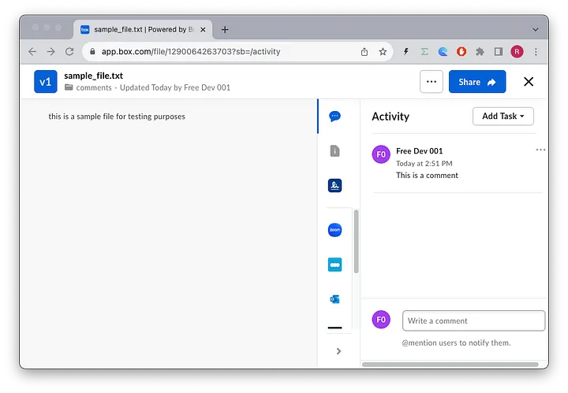

# Comments
Comments are messages generated by Box users on files, allowing users to collaborate together on a file, discussing any feedback they might have on the content.

Each comment is tied to a specific file and user, and comments can be created as independent comments or as replies to previous comments.


## Concepts
Comments can only be applied to file objects, and show up on the sidebar when previewing a file:


## Use cases
You may have an app that processes a file in some way, and you want to add a note that the process is complete or add the process result as a comment to the file.

You are using Box as a content management for your app and you want to implement comments on files in your app. You app can use the file comment feature directly from Box.

You want to make sure a certain user gets a notification about the comment your app in inserting, your app can just @mention_the_user in the comment.

## Files API
References to our documentation:
* [SDK](https://github.com/box/box-python-sdk-gen/blob/main/docs/comments.md)
* [API Guide](https://developer.box.com/guides/comments/create-comment/)
* [API Reference](https://developer.box.com/reference/resources/comment/)


# Exercises
## Setup
Create a `comments_init.py` file on the root of the project and execute the following code:
```python
"""create sample content to box"""
import logging
from utils.box_client_oauth import ConfigOAuth, get_client_oauth

from workshops.comments.create_samples import create_samples

logging.basicConfig(level=logging.INFO)
logging.getLogger("box_sdk_gen").setLevel(logging.CRITICAL)

conf = ConfigOAuth()


def main():
    client = get_client_oauth(conf)
    create_samples(client)


if __name__ == "__main__":
    main()
```
Result:
```
INFO:root:Folder workshops with id: 223095001439
INFO:root:Folder comments with id: 223269791429
INFO:root:      Uploaded sample_file.txt
```
Now open your Box.com app, and enter some comments on the `sample_file.txt` file, under `ALL Files > workshops > comments` folder, and take note of the `file_id` in the URL.
For examples:


Next, create a `comments.py` file on the root of the project that you will use to write your code.
Create a global constant named `COMMENTS_ROOT` and make it equal to the id of the `comments` folder, in my case `223269791429`
Create a global constant named `SAMPLE_FILE` and make it equal to the id of the `sample_file.txt` file, in my case `1290064263703`

```python
"""Box File Comments"""

import logging

from box_sdk_gen.client import BoxClient as Client
from box_sdk_gen.fetch import APIException
from box_sdk_gen.schemas import File, Comment

from box_sdk_gen.managers.comments import CreateCommentItemArg, CreateCommentItemArgTypeField

from utils.box_client_oauth import ConfigOAuth, get_client_oauth

logging.basicConfig(level=logging.INFO)
logging.getLogger("box_sdk_gen").setLevel(logging.CRITICAL)


COMMENTS_ROOT = "223269791429"
SAMPLE_FILE = "1290064263703"


def main():
    """Simple script to demonstrate how to use the Box SDK"""
    conf = ConfigOAuth()
    client = get_client_oauth(conf)

    user = client.users.get_user_me()
    print(f"\nHello, I'm {user.name} ({user.login}) [{user.id}]")


if __name__ == "__main__":
    main()
```


## List file comments
Create a method to list all the comments on a file object.
```python
def file_comments_print(client: Client, file: File):
    """Print all comments for a file"""
    comments = client.comments.get_file_comments(file.id)
    print(f"\nComments for file {file.name} ({file.id}):")
    print("-" * 10)
    for comment in comments.entries:
        if comment.is_reply_comment:
            print(">" * 2, end="")
        print(f"{comment.message} by {comment.created_by.name} ({comment.created_at})")
    print("-" * 10)
```
Then use it in your main method:
```python
def main():
    ...

    # print file comments
    file_comments_print(client, file)
```
Resulting in:
```
Hello, I'm Free Dev 001 (barduinor+001@gmail.com) [25428698627]

Comments for file sample_file.txt (1290064263703):
----------
----------
```
## Add a comment to a file
Create a method to add a comment to a file.
```python
def file_comment_add(client: Client, file: File, message: str) -> Comment:
    """Add a comment to a file"""
    item_arg = CreateCommentItemArg(id=file.id, type=CreateCommentItemArgTypeField.FILE)
    return client.comments.create_comment(message, item=item_arg)
```
And then add it to the main method:
```python
def main():
    ...

    # add first comment
    comment = file_comment_add(client, file, "This is a comment")
    file_comments_print(client, file)

    # add another comment
    comment = file_comment_add(client, file, "What is this file about?")
    file_comments_print(client, file)
```
Resulting in:
```
Comments for file sample_file.txt (1290064263703):
----------
This is a comment by Free Dev 001 (2023-10-31T14:09:45-07:00)
----------

Comments for file sample_file.txt (1290064263703):
----------
This is a comment by Free Dev 001 (2023-10-31T14:09:45-07:00)
What is this file about? by Free Dev 001 (2023-10-31T14:09:46-07:00)
----------
```
## Reply to a comment
You can also specifically reply to a comment. Let's create a reply method:
```python
def file_comment_reply(client: Client, comment: Comment, message: str) -> Comment:
    """Reply to a comment"""
    item_arg = CreateCommentItemArg(id=comment.id, type=CreateCommentItemArgTypeField.COMMENT)
    return client.comments.create_comment(message, item_arg)
```
and add it to the main method:
```python
def main():
    ...

    # reply to the last comment
    comment_reply = file_comment_reply(client, comment, "I hear you!!! This is a sample file")
    file_comments_print(client, file)
```
Resulting in:
```
Comments for file sample_file.txt (1290064263703):
----------
This is a comment by Free Dev 001 (2023-10-31T14:09:45-07:00)
What is this file about? by Free Dev 001 (2023-10-31T14:09:46-07:00)
>>I hear you!!! This is a sample file by Free Dev 001 (2023-10-31T14:09:47-07:00)
----------
```
## Deleting comments
You can also delete comments, let's create a method for that:
```python
def file_comment_delete(client: Client, comment: Comment):
    """Delete a comment"""
    try:
        client.comments.delete_comment_by_id(comment.id)
    except APIException as err:
        if err.status != 404:
            raise err
```
The exception is to handle the case where the comment was already deleted.
This may happen when we delete a comment which also deletes all the replies, and then try to delete the reply again.
In your main method, delete all comments for the file:
```python
def main():
    ...

    # delete all comments
    file_comment_delete(client, comment_reply)
    comments = client.comments.get_file_comments(file.id)
    for comment in comments.entries:
        file_comment_delete(client, comment)
    file_comments_print(client, file)
```
Resulting in:
```
Comments for file sample_file.txt (1290064263703):
----------
----------
```
## Extra Credit
There are a few more things you can do with comments:
* Create a method to Edit a comment
* Create a methods that serializes a comment to JSON
* Improve the print method to print the replies to a comment indented
* Try adding a comment that mentions a user


# Final thoughts
Comments really shine when you have a lot of users collaborating on a file, and you want to keep track of the conversation.

