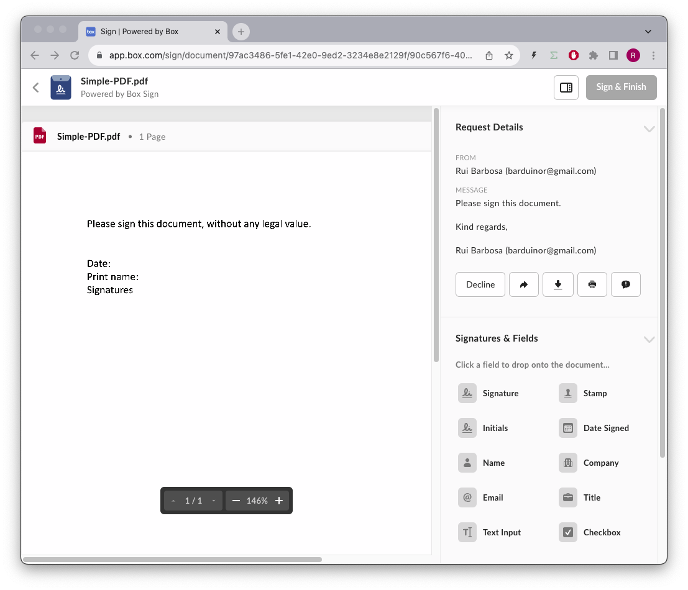
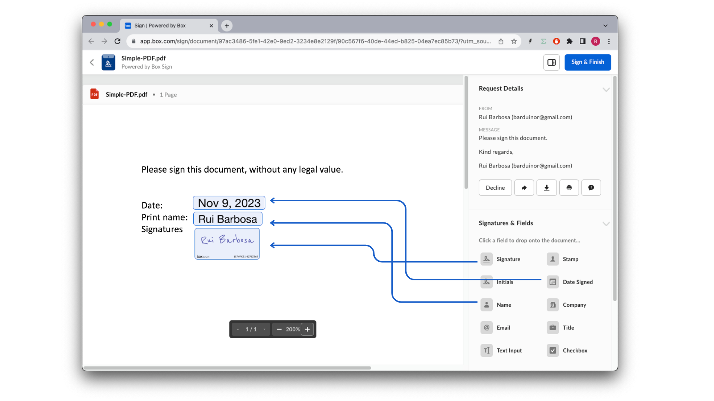
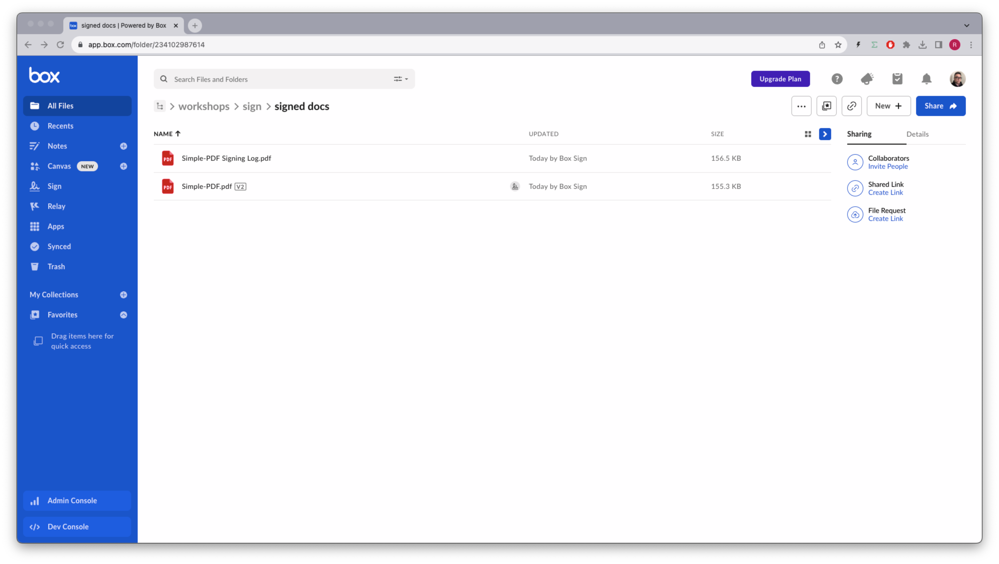

# Sign

## Pre-requisites
Make sure your Box app is configured to use the following scopes:


> ### Note
> If the application scope is not available, then your account can not use the Sign API and you wont be able to complete this exercise.

## Concepts


## Sign API
References to our documentation:
* [SDK Sign](https://github.com/box/box-python-sdk-gen/blob/main/docs/sign_requests.md)
* [API Guide](https://developer.box.com/guides/box-sign/)
* [API Reference ](https://developer.box.com/reference/resources/sign-request/)

# Exercises
## Setup
Create a `sign_init.py` file on the root of the project and execute the following code:
```python
"""create sample content to box"""
import logging
from utils.box_client_oauth import ConfigOAuth, get_client_oauth

from workshops.sign.create_samples import create_samples

logging.basicConfig(level=logging.INFO)
logging.getLogger("box_sdk_gen").setLevel(logging.CRITICAL)

conf = ConfigOAuth()


def main():
    client = get_client_oauth(conf)
    create_samples(client)


if __name__ == "__main__":
    main()
```
Result:
```
INFO:root:Folder workshops with id: 234108232105
INFO:root:Folder sign with id: 234103953351
INFO:root:Folder signed docs with id: 234102987614
INFO:root:Folder docs with id: 234103761574
INFO:root:      Uploaded Simple-PDF.pdf (1355143830404) 17639 bytes
INFO:root:      Uploaded Scholarship-Contract-Prep.docx (1358047520478) 16365 bytes
INFO:root:      Uploaded Simple-DOC.docx (1358077513913) 12409 bytes
```

Next, create a `sign.py` file on the root of the project that you will use to write your code.
Take note of the above document id's and include statics for them in the doc.

```python
"""Box Shared links"""
import logging

from utils.box_client_oauth import ConfigOAuth, get_client_oauth
from box_sdk_gen.schemas import (
    SignRequestCreateSigner,
    FileBaseTypeField,
    FolderBaseTypeField,
    FileBase,
    FolderMini,
)

logging.basicConfig(level=logging.INFO)
logging.getLogger("box_sdk_gen").setLevel(logging.CRITICAL)

SIGN_DOCS_FOLDER = "234102987614"

SIMPLE_PDF = "1355143830404"
SIMPLE_DOC = "1358077513913"
CONTRACT = "1358047520478"

def sign_doc_single(
    client: Client,
    doc_id: str,
    signer_email: str,
    sign_docs_folder: str,
    is_document_preparation_needed: bool = False,
) -> SignRequest:
    """Single doc sign by single signer"""
    # make sure file is accessible to this user
    file = client.files.get_file_by_id(file_id=doc_id)
    return client.sign_requests.create_sign_request(
        signers=[SignRequestCreateSigner(email=signer_email)],
        parent_folder=FolderMini(
            id=sign_docs_folder, type=FolderBaseTypeField.FOLDER.value
        ),
        source_files=[FileBase(id=file.id, type=FileBaseTypeField.FILE.value)],
        is_document_preparation_needed=is_document_preparation_needed,
    )


def main():
    """Simple script to demonstrate how to use the Box SDK"""
    conf = ConfigOAuth()
    client = get_client_oauth(conf)

    user = client.users.get_user_me()
    print(f"\nHello, I'm {user.name} ({user.login}) [{user.id}]")


if __name__ == "__main__":
    main()
```
Resulting in:
```
Hello, I'm Rui Barbosa  [18622116055]
```

## Sign a document
Imagine you need to have adhoc documents signed by a single person. 

These documents are typically not structured, the signature requirements and placement vary from document to document. 

Create a method to sign a document with a single signer:
```python
def sign_doc_single(
    client: Client,
    doc_id: str,
    signer_email: str,
    sign_docs_folder: str,
    is_document_preparation_needed: bool = False,
) -> SignRequest:
    """Single doc sign by single signer"""
    # make sure file is accessible to this user
    file = client.files.get_file_by_id(file_id=doc_id)
    return client.sign_requests.create_sign_request(
        signers=[SignRequestCreateSigner(email=signer_email)],
        parent_folder=FolderMini(
            id=sign_docs_folder, type=FolderBaseTypeField.FOLDER.value
        ),
        source_files=[FileBase(id=file.id, type=FileBaseTypeField.FILE.value)],
        is_document_preparation_needed=is_document_preparation_needed,
    )
```
And use it in the main method. In my case I'm using a different email for the signer from the one I'm in my Box account. Use an email that you have access to:
```python
def main():
    ...

    # Simple sign request
    simple_sign_request = sign_doc_single(
        client,
        SIMPLE_PDF,
        "barbasr@gmail.com",
        SIGN_DOCS_FOLDER,
        False,
    )
    print(f"\nSimple sign request: {simple_sign_request.id}")
    print(f"  Status: {simple_sign_request.status.value}")
    print(f"  Signers: {simple_sign_request.signers[0].email}")
    print(f"  Prepare url: {simple_sign_request.prepare_url}") 
```

Resulting in:

```
Simple sign request: 97ac3486-5fe1-42e0-9ed2-3234e8e2129f
  Status: converting
  Signers: barduinor@gmail.com
  Prepare url: None
```
In the mean time check your Box Sign app and you should see something like this:

Feel free to inspect the details of the sign request.

You should have also received an email with the sign request:


Lets sign the document. Click on the link, click accept and continue, and you should see something like this:



To be able to complete the sign process, you need to at least drag a signature pad into your document:



Go ahead, click the `Sign & Finish button` to complete the sign process.

Back to your Box.com account under Sign you should see the updated status (you might need to refresh the page):


In your signed docs folder you now have the signed pdf and the signature details log:



Go ahead and explore the details of the documents.

You probably noticed that the application is forcing the signer to correctly place the signature pad in the document, hopefully in the right place, and also the rest of the signature requirements like `full name` and `signature date`.

This is not ideal.

## Sign a document with preparation
For these unstructured document your app can require a document preparation so that the `sender` can define the signature requirements and placement.

This way when the `signer` receives the sign request, the document is already prepared and the signer only needs to sign the document.

Comment your previous section of code and add a section on you main for this:
```python
def main()
    ...
    # # Simple sign a pdf request
    # sign_pdf = sign_doc_single(
    ...

    sign_pdf_prep = sign_doc_single(
        client,
        SIMPLE_PDF,
        "barbasr@gmail.com",
        SIGN_DOCS_FOLDER,
        True,
    )
    print(f"\nSimple sign request with prep: {sign_pdf_prep.id}")
    print(f"  Status: {sign_pdf_prep.status.value}")
    print(f"  Signers: {sign_pdf_prep.signers[0].email}")
    print(f"  Prepare url: {sign_pdf_prep.prepare_url}")

    if sign_pdf_prep.prepare_url is not None:
        open_browser(sign_pdf_prep.prepare_url)
```

Resulting in:
```
Simple sign request with prep: 1358028452508-f58485ec-6779-4456-8d83-fafcfb2165c9
  Status: converting
  Signers: barduinor@gmail.com
  Prepare url: https://app.box.com/sign/document/1358028452508-f58485ec-6779-4456-8d83-fafcfb2165c9/a8489c98bb3fbd5504482185a7a17f400d5964143fea37c5d27c0dee0c8ca31e/prepare_doc/
```

And your browser should open with the document preparation page.
Like before, drag the signature pad, the full name and the date to the appropriate places in the document, and click `Send Request`:


After the signer receives the email and opens the sign request, the document is already prepared and the signer only needs to sign the document:


Go ahead complete the sign process, and check your `Sign` status and the signed docs folder.

## Multiple signers
What if you have a document that needs to be signed by multiple people? This is typical of contracts between two or more entities.

Having multiple `signers` introduces another dimension to the sign process, the order in which the signers need to sign the document.

If you do not specify the order, the request is sent to everyone at the same time, and when all parties signed the document, they receive a copy with all signatures.

If you specify the order, the send request is sent to the first signer, and only when the first signer signs the document, the request is sent to the second signer, and so on.

Let's see this working with an example contract between and university and a student for a scholarship. In this case the institution must sign first.

Let create a method specific for this:

```python
def sign_contract(
    client: Client, institution_email: str, student_email: str
) -> SignRequest:
    """Sign contract"""
    # make sure file is accessible to this user
    file = client.files.get_file_by_id(file_id=CONTRACT)

    # signers
    institution = SignRequestCreateSigner(
        email=institution_email,
        role=SignRequestCreateSignerRoleField.SIGNER,
        order=1,
    )

    student = SignRequestCreateSigner(
        email=student_email,
        role=SignRequestCreateSignerRoleField.SIGNER,
        order=2,
    )

    # create sign request
    sign_request = client.sign_requests.create_sign_request(
        signers=[institution, student],
        parent_folder=FolderMini(
            id=SIGN_DOCS_FOLDER, type=FolderBaseTypeField.FOLDER.value
        ),
        source_files=[FileBase(id=file.id, type=FileBaseTypeField.FILE.value)],
        is_document_preparation_needed=True,
    )

    print(f"\nSimple sign request with prep: {sign_request.id}")
    print(f"  Status: {sign_request.status.value}")
    print(f"  Signers: {sign_request.signers[0].email}")
    print(f"  Prepare url: {sign_request.prepare_url}")

    if sign_request.prepare_url is not None:
        open_browser(sign_request.prepare_url)

    return sign_request
```

And use it in the main method:
```python
def main():
    ...

    # Multiple signers
    sign_contract_multi = sign_contract(
        client,
        institution_email="barbasr+inst@gmail.com",
        student_email="barbasr+std@gmail.com",
    )

    if sign_contract_multi.prepare_url is not None:
        open_browser(sign_contract_multi.prepare_url)
```
You browser should open with the document preparation page. 

Notice you now have two signers, with the order already specified. The color is also important to identify which signer is which (in this case the institution is blue and the student is green), determining which signer pad, name and date belongs to which signer.

Like before, drag the signature pad, the full name and the date to the appropriate places in the document, and click `Send Request`:


If you look at the sign request details, you should see something like this:


Indicating that the first request was sent, but the second is waiting for the first to be completed.

Go ahead and complete the sign process for both signers.

Notice that when you get the second request it is already signed by the first signer.


## Extra Credit


# Final thoughts


