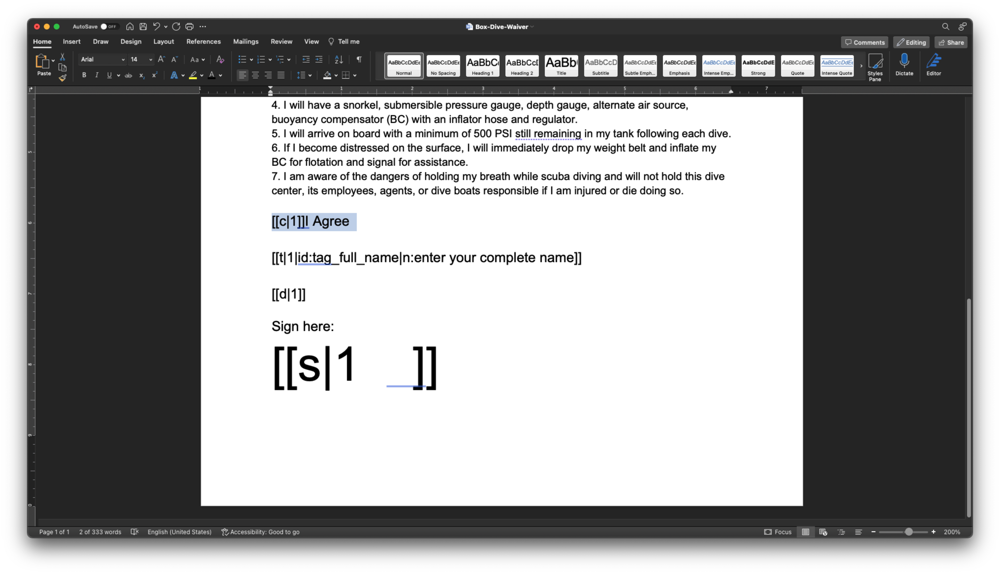
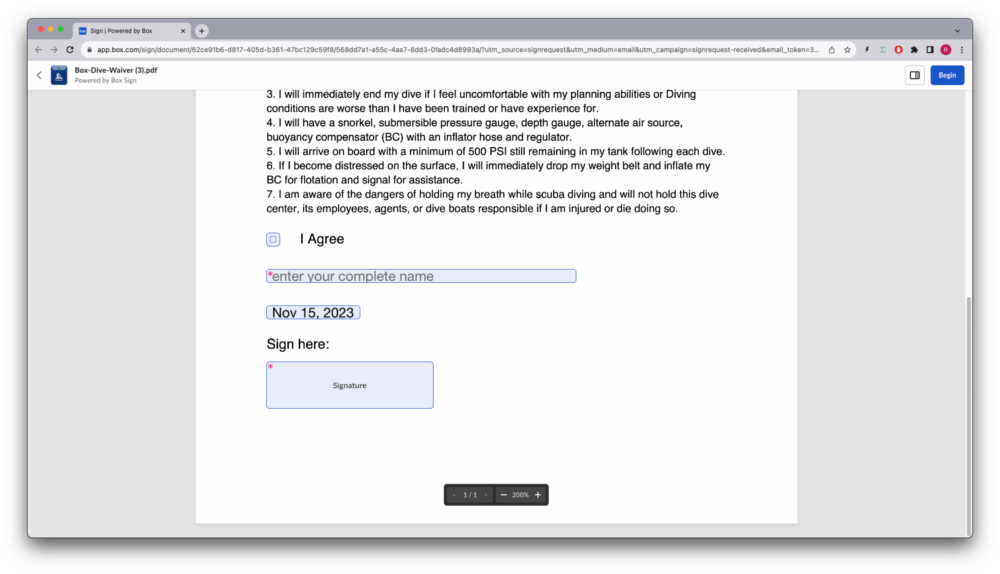
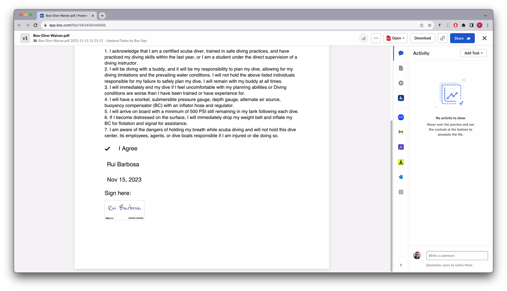

# Sign Templates


## Pre-requisites
Make sure your Box app is configured to use the following scopes:


> ### Note
> If the application scope is not available, then your account can not use the Sign API and you wont be able to complete this exercise.

## Sign API
References to our documentation:
* [SDK Sign](https://github.com/box/box-python-sdk-gen/blob/main/docs/sign_requests.md)
* [API Guide](https://developer.box.com/guides/box-sign/)
* [API Reference ](https://developer.box.com/reference/resources/sign-request/)
* [Sign Guide](https://support.box.com/hc/en-us/articles/4404105810195-Sending-a-document-for-signature)
* [Structured Documents Guide](https://support.box.com/hc/en-us/articles/4404085855251-Creating-templates-using-tags)

# Exercises
## Setup
Create a `sign_init.py` file on the root of the project and execute the following code:
```python
"""create sample content to box"""
import logging
from utils.box_client_oauth import ConfigOAuth, get_client_oauth

from workshops.sign_structured.create_samples import create_samples

logging.basicConfig(level=logging.INFO)
logging.getLogger("box_sdk_gen").setLevel(logging.CRITICAL)

conf = ConfigOAuth()


def main():
    client = get_client_oauth(conf)
    create_samples(client)


if __name__ == "__main__":
    main()
```
Result:
```
INFO:root:Folder workshops with id: 234108232105
INFO:root:Folder sign with id: 234103953351
INFO:root:Folder signed docs with id: 234102987614
INFO:root:Folder docs with id: 234103761574
INFO:root:      Uploaded Box-Dive-Waiver.docx (1363379762284) 7409 bytes
```

Next, create a `sign_structured.py` file on the root of the project that you will use to write your code.
Take note of the above document id's and include statics for them in the doc.
Replace the `YOUR_EMAIL` with your email, or use a different email for each signer.

```python
"""Box Shared links"""
import logging

from utils.box_client_oauth import ConfigOAuth, get_client_oauth
from box_sdk_gen.client import BoxClient as Client
from box_sdk_gen.schemas import (
    SignRequest,
    SignRequestCreateSigner,
    SignRequestPrefillTag,
    FolderBaseTypeField,
    FolderMini,
)

# from utils.oauth_callback import open_browser

logging.basicConfig(level=logging.INFO)
logging.getLogger("box_sdk_gen").setLevel(logging.CRITICAL)

SIGN_DOCS_FOLDER = "234102987614"

STRUCTURED_DOC = "1363379762284"

SIGNER_A = "YOUR_EMAIL+A@gmail.com"

def check_sign_request(sign_request: SignRequest):
    print(f"\nSimple sign request: {sign_request.id}")
    print(f"  Status: {sign_request.status.value}")
    print(f"  Signers: {len(sign_request.signers)}")
    for signer in sign_request.signers:
        print(f"    {signer.role.value}: {signer.email}")
    print(f"  Prepare url: {sign_request.prepare_url}")


def main():
    """Simple script to demonstrate how to use the Box SDK"""
    conf = ConfigOAuth()
    client = get_client_oauth(conf)

    user = client.users.get_user_me()
    print(f"\nHello, I'm {user.name} ({user.login}) [{user.id}]")


if __name__ == "__main__":
    main()

```
Resulting in:
```
Hello, I'm Rui Barbosa  [18622116055]
```

## Concepts

A structured document in the context of Box Sign is a document that includes special tags that can be recognized by the Sign API. These tags are used to place the signature properties, like name, date, signature, etc., in the document, associated with a specific signer.

This allows your app to handle a dynamic generated document that is ready to be signed, which has a couple of advantages:
* The document can be dynamically generated, and the signature properties can be added to the document before creating the signature request, effectively bypassing the document preparation step.
* The document format can be handled outside Box Sign templates, allowing higher flexibility and integration with external document management systems.


## Anatomy of a structured document
Here is an example of a [structured document](content_samples/Box-Dive-Waiver.docx).
At first glance, it looks like a regular document, but if you select all of the text and set the text color to back you'll see this:



In the sample above `[[c|1]]` means a checkbox assigned to signer 1, and `[[s|1]]` means a signature assigned to signer 1. Notice how the signature pad is using font size 48 to reserve space vertically for the signature.

The `[[t|1|id:tag_full_name|n:enter your complete name]]` means a name tag assigned to signer 1, with the label `enter your complete name`, and using an id of `tag_full_name`.

Check out this [support note](https://support.box.com/hc/en-us/articles/4404085855251-Creating-templates-using-tags) for a complete description of all the tags available.

> Setting the tags to the same color as the background will make them invisible, but they will still be there.

> The number in the tags refer to the signer number, so `[[c|1]]` is the checkbox for signer 1, `[[c|2]]` is the checkbox for signer 2, and so on, *NOT* the signing order.

> Tag 0 is reserved for the `sender`, which always exist. So even if the `sender` does not need to input any data into the document, the other signers must start with 1.

## Create a signature request from a structured document
Lets put this in practice. Consider this method:
```python
def create_sign_request_structured(
    client: Client, file_id: str, signer_email: str
) -> SignRequest:
    """Create a sign request with structured data"""
    # make sure file is accessible to this user
    file = client.files.get_file_by_id(file_id)

    # Sign request params
    source_file = FileBase(id=file.id, type=FileBaseTypeField.FILE.value)
    parent_folder = FolderMini(
        id=SIGN_DOCS_FOLDER, type=FolderBaseTypeField.FOLDER.value
    )
    signer = SignRequestCreateSigner(signer_email)

    # Create a sign request
    sign_request = client.sign_requests.create_sign_request(
        signers=[signer],
        parent_folder=parent_folder,
        source_files=[source_file],
    )

    return sign_request
```
Using it in the main method:
```python
def main():
    ...

    # Create a sign request with structured data
    sign_request = create_sign_request_structured(
        client, STRUCTURED_DOC, SIGNER_A
    )
    check_sign_request(sign_request)
```
Resulting in:
```
Simple sign request: 6878e048-e9bd-4fb1-88c6-8e502783e8d0
  Status: converting
  Signers: 2
    final_copy_reader: ...@gmail.com
    signer: YOUR_EMAIL+a@gmail.com
  Prepare url: None
```
Go to the ` signer` email inbox and open the email from Box Sign. Click on the Review and Sign button and you'll see the document with the tags in place:



Complete the signing process and you'll see the document in the `signed docs` folder.




## Pre-populate the signature attributes

If we have an external id in the document tags we can use it to pre-populate their values. For example, we have a tag with the id `tag_full_name` we can use it to pre-populate the name of the signer.

```python
def create_sign_request_structured_with_prefill(
    client: Client, file_id: str, signer_name, signer_email: str
) -> SignRequest:
    """Create a sign request with structured data"""
    # make sure file is accessible to this user
    file = client.files.get_file_by_id(file_id)

    # Sign request params
    source_file = FileBase(id=file.id, type=FileBaseTypeField.FILE.value)
    parent_folder = FolderMini(
        id=SIGN_DOCS_FOLDER, type=FolderBaseTypeField.FOLDER.value
    )
    signer = SignRequestCreateSigner(signer_email)

    # tags
    tag_full_name = SignRequestPrefillTag(
        document_tag_id="tag_full_name",
        text_value=signer_name,
    )

    # Create a sign request
    sign_request = client.sign_requests.create_sign_request(
        signers=[signer],
        parent_folder=parent_folder,
        source_files=[source_file],
        prefill_tags=[tag_full_name],
    )

    return sign_request
```
Using it in the main method:
```python
def main():
    ...

    # Create a sign request with name pre populate
    sign_request_pre_pop = create_sign_request_structured_with_prefill(
        client, STRUCTURED_DOC, "Rui Barbosa", SIGNER_A
    )
    check_sign_request(sign_request_pre_pop)
```
Resulting in:
```
Simple sign request: 7b86e46c-72ba-4568-a6ff-787077cca007
  Status: converting
  Signers: 2
    final_copy_reader: ...@gmail.com
    signer: YOUR_EMAIL+a@gmail.com
  Prepare url: None
```
Go to the `signer` email inbox and open the email from Box Sign. Click on the Review and Sign button and you'll see the document with the name pre-populated:


Complete the signing process and you'll see the document in the `signed docs` folder.

# Extract information from a signed document
Lets say we want to extract the name of the signer, and the other properties from the signed document. This is useful if you need to tie the information from the sign request back into your systems.
Lets create a method to extract the information from the signed request:
```python
def check_sign_request_by_id(client: Client, sign_request_id: str):
    """Check sign request by id"""
    sign_request = client.sign_requests.get_sign_request_by_id(sign_request_id)

    print(f"\nSimple sign request: {sign_request.id}")
    print(f"  Status: {sign_request.status.value}")

    print(f"  Signers: {len(sign_request.signers)}")
    for signer in sign_request.signers:
        print(f"    {signer.role.value}: {signer.email}")
        for input in signer.inputs:
            content_type = input.content_type
            value = None

            if content_type == SignRequestSignerInputTypeField.CHECKBOX:
                value = input.checkbox_value
            elif content_type == SignRequestSignerInputTypeField.TEXT:
                value = input.text_value
            elif content_type == SignRequestSignerInputTypeField.DATE:
                value = input.date_value

            print(
                f"      {input.type.value}: {value if value is not None else '<other>'}"
            )

    print(f"  Prepare url: {sign_request.prepare_url}")
```
Using it in the main method with the sign request id from the previous exercise:
```python
def main():
    ...

    # Latest sign request
    LATEST_SIGN_REQUEST = "7b86e46c-72ba-4568-a6ff-787077cca007"
    check_sign_request_by_id(client, LATEST_SIGN_REQUEST)
```
Resulting in:
```
Simple sign request: 7b86e46c-72ba-4568-a6ff-787077cca007
  Status: signed
  Signers: 2
    final_copy_reader: ...@gmail.com
    signer: YOUR_EMAIL+a@gmail.com
      checkbox: True
      text: Rui Barbosa
      date: 2023-11-15
      signature: <other>
  Prepare url: None
```

## Extra Credit
There are many other signature attributes that can be pre-populated, like the `company_name`, `dropdown`, and `checkboxes`.

Create a new structured document or modify an existing one to include more attributes, and pre-populate them in the signature request.

# Final thoughts
Structured documents are a great way to integrate with external document management systems, and to create dynamic documents that are ready to be signed.

If your document signature requirements have a lot of options, you can pre-populate these from another data source and save the user time.
Just remember that the user who owns these properties can always change them.

The same way that after the document is signed you can extract the information from the sign request, which is useful if you need to tie information from the sign request back into your systems.


