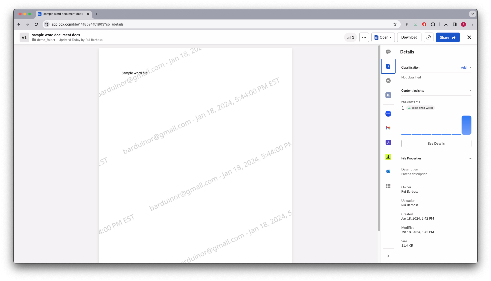
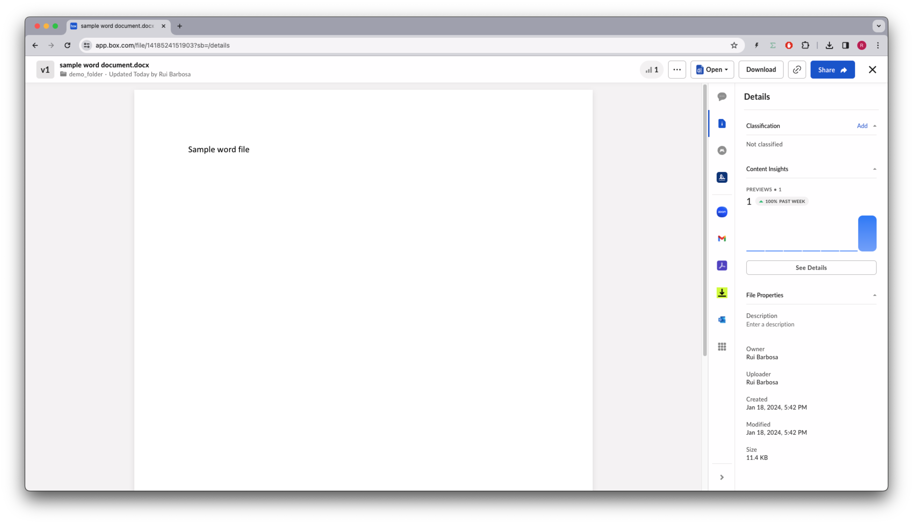
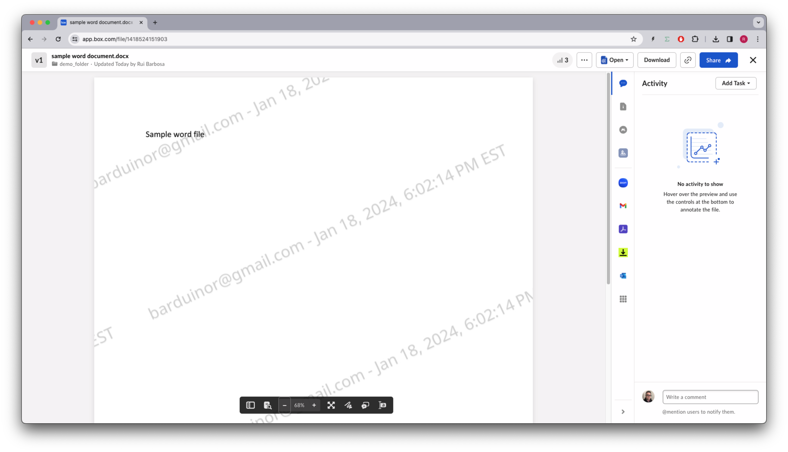

# Watermarks

Watermarking serves as a deterrent to unauthorized sharing of content. When a file or folder is watermarked, the email (or ip address), and a time stamp of the user are added to the preview of the content. This way if a user decides to print or screenshot the content, the watermark will be visible.

## Pre-requisites
The free Box accounts do not support watermarking, so you will need to have a Box paid account, or a full developer account to be able to use this feature.

## Concepts

Box watermarking is not the traditional sense of adding a company logo or a draft watermark to a document. Instead, it is a way to add a unique identifier to a file or folder. This identifier is a combination of the user's email address (or ip address), and a time stamp of when the file was previewed. 

The watermark visibility is determined by the user's permissions on the file or folder, and also the type of access such as downloading or previewing.

For a complete list of the watermark visibility rules, please refer to the [support note](https://support.box.com/hc/en-us/articles/360044195253-Watermarking-Files).

Watermarking can be turned on or off for individual documents or for folders, affecting all documents in them.

References to our documentation:
* [API Watermark files](https://developer.box.com/reference/resources/watermark/)
* [API Watermark folders](https://developer.box.com/reference/get-folders-id-watermark/)
* [Support note](https://support.box.com/hc/en-us/articles/360044195253-Watermarking-Files)

# Exercises
## Setup
Create a `watermark_init.py` file on the root of the project and execute the following code:
```python
"""create sample content to box"""
import logging
from utils.box_client_oauth import ConfigOAuth, get_client_oauth

from workshops.watermark.create_samples import create_samples

logging.basicConfig(level=logging.INFO)
logging.getLogger("box_sdk_gen").setLevel(logging.CRITICAL)

conf = ConfigOAuth()


def main():
    client = get_client_oauth(conf)
    create_samples(client)


if __name__ == "__main__":
    main()

```
Result:
```yaml
INFO:root:Folder workshops with id: 234108232105
INFO:root:Folder watermark with id: 244791570933
INFO:root:Folder demo_folder with id: 244798382350
INFO:root:      Uploaded sample word document.docx (1418524151903) 11671 bytes
```

Next, create a `watermark.py` file on the root of the project that you will use to write your code.
Create a DEMO_FOLDER constant with the id of the `demo_folder` folder you got from the previous step.
Create a DEMO_FILE constant with the id of the `sample word document.docx` file you got from the previous step.

```python
import logging

from box_sdk_gen.client import BoxClient as Client
from box_sdk_gen.fetch import APIException
from box_sdk_gen.schemas import (
    Watermark,
)

from box_sdk_gen.managers.file_watermarks import (
    UpdateFileWatermarkWatermark,
    UpdateFileWatermarkWatermarkImprintField,
)

from box_sdk_gen.managers.folder_watermarks import (
    UpdateFolderWatermarkWatermark,
    UpdateFolderWatermarkWatermarkImprintField,
)

from utils.box_client_oauth import ConfigOAuth, get_client_oauth

logging.basicConfig(level=logging.INFO)
logging.getLogger("box_sdk_gen").setLevel(logging.CRITICAL)

DEMO_FOLDER = "244798382350"
DEMO_FILE = "1418524151903"


def main():
    """Simple script to demonstrate how to use the Box SDK"""
    conf = ConfigOAuth()
    client = get_client_oauth(conf)

    me = client.users.get_user_me()
    print(f"\nHello, I'm {me.name} ({me.login}) [{me.id}]")


if __name__ == "__main__":
    main()
```

Resulting in:

```
Hello, I'm Rui Barbosa (barduinor@gmail.com) [18622116055]
```

## Watermarking files
Let's start by creating a method to turn on the watermark for a file. Add the following code to your `watermark.py` file:

```python
def add_watermark_to_file(client: Client, file_id: str) -> Watermark:
    """Watermark a file"""
    update_watermark = UpdateFileWatermarkWatermark(
        UpdateFileWatermarkWatermarkImprintField.DEFAULT
    )
    return client.file_watermarks.update_file_watermark(
        file_id=file_id,
        watermark=update_watermark,
    )

def main():
    ...

    # add watermark to file
    watermark = add_watermark_to_file(client, DEMO_FILE)
    print(
        f"\nWatermark:"
        f"\n  - created  at: {watermark.watermark.created_at}"
        f"\n  - modified at: {watermark.watermark.modified_at}"
    )
```
Resulting in:
```yaml
Watermark:
  - created  at: 2024-01-18T14:43:32-08:00
  - modified at: 2024-01-18T14:43:32-08:00
```

Now if you open your box.com account, navigate to the `demo_folder`, and preview the file you should see the watermark:



Of course, as the owner of the file, you can edit, and download the file without the watermark.

## Remove watermark
Let's now create a method to remove the watermark from a file:

```python
def remove_watermark_from_file(client: Client, file_id: str) -> Watermark:
    """Remove watermark from file"""
    return client.file_watermarks.delete_file_watermark(file_id=file_id)

def main():
    ...

    # remove watermark from file
    remove_watermark_from_file(client, DEMO_FILE)
    print("\nWatermark removed")    
```

Resulting in:
```yaml
Watermark removed
```
If you preview the file again, you should see that the watermark is gone.




## Watermarking folders

Applying watermarks to individual files is a tedious task. Let's now create a method to apply watermarks to all files in a folder:

```python
def add_watermark_to_folder(client: Client, folder_id: str) -> Watermark:
    """Watermark a folder"""
    update_watermark = UpdateFolderWatermarkWatermark(
        UpdateFolderWatermarkWatermarkImprintField.DEFAULT
    )
    return client.folder_watermarks.update_folder_watermark(
        folder_id=folder_id,
        watermark=update_watermark,
    )
    
def main():
    ...

    # add watermark to folder
    watermark = add_watermark_to_folder(client, DEMO_FOLDER)
    print(
        f"\nWatermark:"
        f"\n  - created  at: {watermark.watermark.created_at}"
        f"\n  - modified at: {watermark.watermark.modified_at}"
    )
```

Resulting in:
```yaml
Watermark:
  - created  at: 2024-01-18T15:01:33-08:00
  - modified at: 2024-01-18T15:01:33-08:00
```
Once again if you preview the file you'll see the watermark:



## Remove watermark from folder
Finally let's create a method to remove the watermark from a folder:

```python
def remove_watermark_from_folder(client: Client, folder_id: str) -> Watermark:
    """Remove watermark from folder"""
    return client.folder_watermarks.delete_folder_watermark(
        folder_id=folder_id
    )

def main():
    ...

    # remove watermark from folder
    remove_watermark_from_folder(client, DEMO_FOLDER)
    print("\nWatermark removed")
```

Resulting in:
```yaml
Watermark removed
```
Now that we removed the watermark from the folder, if you preview the file again, you'll see that the watermark is gone.


## Extra credit
* Take a watermarked file and share it with anyone with the link. Then open the shared link in an incognito window and preview the file. What do you see?
* Looking at the support note, try one of the intermediate permission combination and see what happens.

## Final thoughts
Watermarking is way to deter users from sharing content, and must work in tandem with other security features.

Watermarking can also be automatically applied using security policies defined by  administrators, such as [Box Shield](https://medium.com/box-developer-blog/getting-started-with-box-shield-smart-access-97923d96a473).


